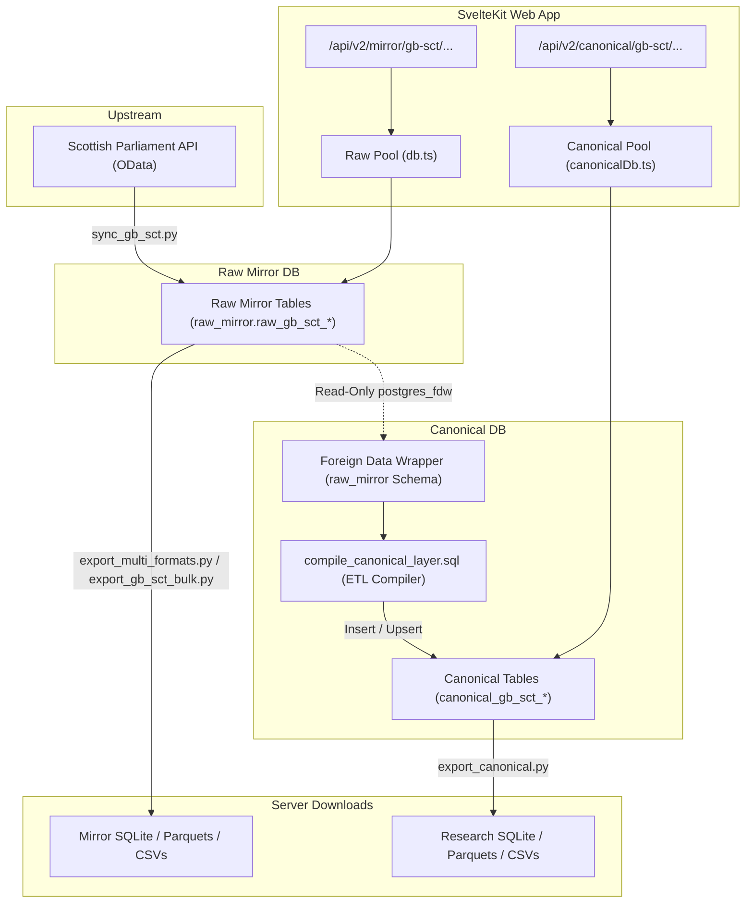

# System Architecture Specification: Scottish Parliament (GB-SCT)

This document provides assembly-specific system blueprints and data flow details for the Scottish Parliament (`gb-sct`) implementation. For core architecture and database pools, see the [Core Repository System Architecture Specification](file:///home/steven/Documents/github/comparativelegislativedata/docs/architecture.md).

---

## 1. System Architecture Blueprint

The following diagram maps the specific data ingest, Postgres FDW, and SvelteKit route mapping layouts for the Scottish Parliament (`gb-sct`) nodes:



---

## 2. Foreign Data Wrapper (FDW) Mappings

Database B (`comparative_legislative_data_canonical`) mounts Database A's raw mirrors under the local schema **`raw_mirror`** using the following PostgreSQL FDW setup:

```sql
CREATE EXTENSION IF NOT EXISTS postgres_fdw;

CREATE SERVER mirror_server
  FOREIGN DATA WRAPPER postgres_fdw
  OPTIONS (host '127.0.0.1', port '5432', dbname 'comparative_legislative_data');

CREATE USER MAPPING FOR chessadmin
  SERVER mirror_server
  OPTIONS (user 'chessadmin', password 'your_password_here');

CREATE USER MAPPING FOR postgres
  SERVER mirror_server
  OPTIONS (user 'postgres', password 'your_password_here');

IMPORT FOREIGN SCHEMA public
  LIMIT TO (
    raw_gb_sct_bills,
    raw_gb_sct_billstages,
    raw_gb_sct_members,
    raw_gb_sct_memberparties,
    raw_gb_sct_parties,
    raw_gb_sct_billstagetypes,
    raw_gb_sct_billtypes
  )
  FROM mirror_server INTO raw_mirror;
```

---

## 3. Specific SQL Compilation Rules (`compile_canonical_layer.sql`)

The Database B view compiler executes specific legislative calculations using the FDW tables:

### 3.1 Durations and Timescales Math
All duration values are calculated as raw calendar days. Sessional recess adjustments are deferred to Tier 3 variables:
*   **Stage 1 Duration:** `Stage 1 Completion Date - Introduction Date`
*   **Stage 2 Duration:** `Stage 2 Completion Date - Stage 1 Completion Date`
*   **Stage 3 Duration:** `Stage 3 Passage Date - Stage 2 Completion Date`

### 3.2 Introduction Date Fallbacks
For bills carrying OData data gaps where sequence `0` (Introduction) is missing, the compiler resolves the date via the earliest recorded event:
```sql
COALESCE(
  MIN(CASE WHEN bt.sequence = 0 THEN bs.stagedate::date END), 
  MIN(bs.stagedate::date)
) AS intro_date
```

### 3.3 Sessional Boundaries & Coalition Map
Parliamentary Session IDs are resolved temporally using the resolved introduction dates:
*   **Session 1:** `1999-05-06` to `2003-04-30` (Governing coalition: Scottish Labour [5] and Liberal Democrats [6]).
*   **Session 2:** `2003-05-01` to `2007-05-02` (Governing coalition: Scottish Labour [5] and Liberal Democrats [6]).
*   **Session 3:** `2007-05-03` to `2011-05-04` (Governing party: SNP [7] Minority).
*   **Session 4:** `2011-05-05` to `2016-05-04` (Governing party: SNP [7] Majority).
*   **Session 5:** `2016-05-05` to `2021-05-12` (Governing party: SNP [7] Minority).
*   **Session 6:** `2021-05-13` onwards (Governing coalition: SNP [7] and Scottish Green Party [4] agreement).

---

## 4. Daily Cron Automation (`cron_daily_sync.sh`)

At 3:00 AM daily, the VPS crontab runs the daily update pipeline script:

```bash
# 1. Ingest new raw OData records into Database A
/home/chessadmin/comparativelegislativedata/.venv/bin/python3 scripts/sync_gb_sct.py

# 2. Rebuild raw mirror Parquets and SQLite database
/home/chessadmin/comparativelegislativedata/.venv/bin/python3 scripts/export_multi_formats.py

# 3. Rebuild raw mirror CSV files
/home/chessadmin/comparativelegislativedata/.venv/bin/python3 scripts/export_gb_sct_bulk.py

# 4. Compile derived variables in Database B (FDW temporal calculations)
sudo -u postgres psql -d comparative_legislative_data_canonical -f /home/chessadmin/comparativelegislativedata/scripts/compile_canonical_layer.sql

# 5. Rebuild canonical research SQLite, Parquet, and CSV files
/home/chessadmin/comparativelegislativedata/.venv/bin/python3 scripts/export_canonical.py
```
